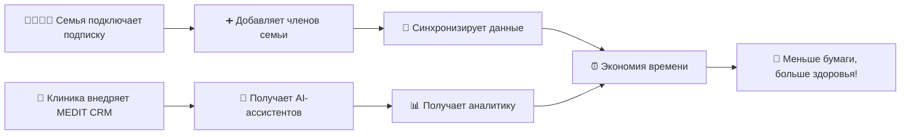
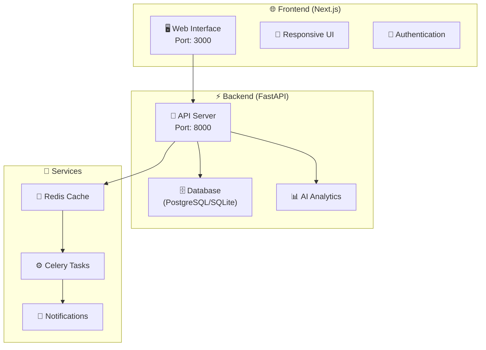

<div align="center">

# 🏥 MEDIT

### *Здоровье семьи в одном приложении*

[](https://nextjs.org/)
[](https://fastapi.tiangolo.com/)
[](https://www.typescriptlang.org/)
[](https://www.python.org/)

</div>

---

## 🌟 О проекте

**MEDIT** — это инновационная медицинская платформа, которая объединяет семейные аккаунты, управление здоровьем, электронные медкарты и телемедицинские сервисы в одном удобном приложении.

### 👨‍👩‍👧‍👦 Для семей

> **Единая семейная подписка** — управляйте здоровьем всех родных без лишних затрат!

- 👶 **Родители** — контролируйте прививки и осмотры детей
- 👴 **Взрослые** — следите за здоровьем пожилых родителей  
- 👨‍👩‍👧‍👦 **Вся семья** — общие медкарты, напоминания, онлайн-консультации

#### 💰 Выгода семейной подписки:
- ✅ До **5 членов семьи** в одной учетной записи
- ✅ Экономия до **40%** vs индивидуальные подписки
- ✅ Гибкие настройки доступа — кто что видит и управляет

### 🏥 Для клиник

> **AI-CRM для медицинских учреждений** — автоматизируйте работу с пациентами!

- 🤖 **AI-ассистент врача** — анализирует симптомы, предлагает предварительные диагнозы
- 📅 **Автоматическое расписание** — оптимизация записи, снижение простоев
- 🔔 **Умные напоминания** — пациентам о визитах, врачам о важных случаях
- 📊 **Аналитика потока пациентов** — прогнозирование загрузки, динамика заболеваний

---

## 🎯 Почему выбирают MEDIT?

<table>
<tr>
<td width="50%">

### 👨‍👩‍👧‍👦 Для семей
- 🔒 Все медицинские данные в одном безопасном месте
- 👥 Совместный доступ — муж, жена, дети, родители
- 🧠 AI-анализ здоровья — ранние предупреждения о рисках

</td>
<td width="50%">

### 🏥 Для клиник
- ⚡ Уменьшение нагрузки на администраторов — AI берет на себя 50% рутины
- 💙 Удержание пациентов — удобный сервис = больше лояльности
- 🔗 Интеграция с медоборудованием — автоматическая загрузка анализов

</td>
</tr>
</table>

---

## 🚀 Как это работает?



---

## ⭐ Основные функции

### 1. 👨‍👩‍👧‍👦 Семейные аккаунты
- 📋 Объединение медицинских данных всех членов семьи в одном месте
- 🔐 Гибкие права доступа (родители могут управлять данными детей)
- 📅 Общий календарь приёмов, напоминания о прививках и обследованиях

### 2. 💊 Управление здоровьем
- 📈 Медицинская аналитика — тренды по анализам, давлению, уровню сахара
- 💊 Контроль приёма лекарств — напоминания, предупреждения о несовместимости
- 📱 Интеграция с медприборами (глюкометры, тонометры, фитнес-трекеры)

### 3. 👨‍⚕️ Запись к врачам
- 🌐 Онлайн-запись в клиники-партнёры
- 🔄 Синхронизация с семейным календарём
- 🤖 AI-ассистент для подбора специалиста по симптомам

### 4. 💻 Телемедицина
- 📹 Видеоконсультации с врачами
- 💊 Электронные рецепты с доставкой в аптеки


---

## 🛠️ Технологический стек

### 🚀 Frontend
<div align="left">


</div>

### ⚡ Backend
<div align="left">


</div>

### 🔧 Дополнительные технологии
<div align="left">


</div>

<details>
<summary>📋 Подробное описание технологий</summary>

#### Frontend
- **Next.js 13+** — React фреймворк с App Router
- **TypeScript** — типизированный JavaScript для надежности кода
- **Tailwind CSS** — utility-first CSS фреймворк для быстрой разработки UI
- **React 18+** — библиотека для создания пользовательских интерфейсов

#### Backend
- **FastAPI** — высокопроизводительный фреймворк для построения API
- **SQLAlchemy** — ORM для работы с базой данных
- **PostgreSQL** — основная СУБД (SQLite для разработки)
- **Pydantic** — валидация данных и сериализация
- **Python 3.8+** — язык программирования

#### Дополнительные компоненты
- **JWT** — аутентификация пользователей
- **Celery** — обработка асинхронных задач (напоминания, уведомления)
- **Redis** — кэширование и брокер сообщений для Celery
- **Docker** — контейнеризация приложения

</details>

---

## 🤝 Участие в разработке

Мы приветствуем вклад в развитие MEDIT! Вот как вы можете помочь:

### 🔧 Как внести вклад

1. 🍴 **Fork** репозиторий
2. 🌿 Создайте ветку для новой функции (`git checkout -b feature/amazing-feature`)
3. 💾 Зафиксируйте изменения (`git commit -m 'Add amazing feature'`)
4. 📤 Отправьте в ветку (`git push origin feature/amazing-feature`)
5. 🔄 Откройте Pull Request

### 📋 Правила разработки

- 📝 Следуйте существующему стилю кода
- ✅ Добавляйте тесты для новых функций
- 📚 Обновляйте документацию при необходимости
- 🔍 Проверяйте код линтерами перед коммитом

### 🐛 Сообщение об ошибках

Если вы нашли ошибку, пожалуйста:
1. 🔍 Проверьте, не была ли она уже сообщена
2. 📝 Создайте подробный отчет с шагами воспроизведения
3. 📎 Приложите скриншоты или логи, если возможно

---

---

## 🏗️ Архитектура

<div align="center">



</div>

### 🎯 Компоненты системы

- 🌐 **Frontend** — Next.js приложение с современным UI (порт 3000)
- ⚡ **Backend** — FastAPI сервер с высокой производительностью (порт 8000)
- 🗄️ **База данных** — PostgreSQL для продакшена, SQLite для разработки
- 📮 **Кэширование** — Redis для быстрого доступа к данным
- ⚙️ **Фоновые задачи** — Celery для обработки уведомлений и аналитики

---

## 🚀 Быстрый старт

### 📋 Предварительные требования

- 🐍 Python 3.8+
- 📦 Node.js 18+
- 🗄️ PostgreSQL (опционально)
- 📮 Redis (опционально)

### 🔧 Установка и запуск

#### 1️⃣ Backend

```bash
# Переходим в директорию backend
cd backend

# Создаем виртуальное окружение
python -m venv venv

# Активируем виртуальное окружение
# Windows:
venv\Scripts\activate
# Linux/Mac:
source venv/bin/activate

# Устанавливаем зависимости
pip install -r requirements.txt

# Запускаем сервер
uvicorn main:app --reload --host 0.0.0.0 --port 8000
```

#### 2️⃣ Frontend

```bash
# Переходим в директорию frontend
cd frontend

# Устанавливаем зависимости
npm install

# Запускаем dev сервер
npm run dev
```

#### 3️⃣ Docker (альтернативный способ)

```bash
# Запуск всего проекта одной командой
docker-compose up --build
```

### 🌐 Доступ к приложению

<table>
<tr>
<td align="center">

**🖥️ Frontend**

[http://localhost:3000](http://localhost:3000)

*Основной интерфейс приложения*

</td>
<td align="center">

**📚 Backend API**

[http://localhost:8000/docs](http://localhost:8000/docs)

*Swagger документация API*

</td>
</tr>
</table>

---

## 📁 Структура проекта

```
🏥 MEDIT/
├── 🔧 backend/                     # ⚡ Серверная часть (FastAPI)
│   ├── 📦 app/                     # 🚀 Основной код приложения
│   │   ├── 🌐 api/                 # 📡 API endpoints
│   │   ├── ⚙️ core/                # 🔧 Основные настройки
│   │   ├── 🗄️ database/            # 💾 Работа с БД
│   │   ├── 📋 models/              # 🏗️ Модели данных
│   │   ├── 📝 schemas/             # 📊 Pydantic схемы
│   │   └── 🔨 services/            # 🛠️ Бизнес-логика
│   ├── 🐍 venv/                    # 📦 Виртуальное окружение Python
│   ├── ⚙️ .env.example             # 🔑 Пример файла окружения
│   ├── 🐳 Dockerfile               # 📦 Конфигурация Docker
│   ├── 🚀 main.py                  # 🎯 Точка входа сервера
│   ├── 💾 medit.db                 # 🗄️ База данных SQLite
│   ├── 📚 README.md                # 📖 Документация бэкенда
│   └── 📋 requirements.txt         # 📦 Зависимости Python
│
├── 🌐 frontend/                    # 🖥️ Клиентская часть (Next.js)
│   ├── ⚡ .next/                   # 🔨 Сборка Next.js
│   ├── 📱 app/                     # 🛣️ App Router (Next.js 13+)
│   │   ├── 🔐 auth/                # 🔑 Страницы аутентификации
│   │   ├── 📊 dashboard/           # 📈 Панель управления
│   │   ├── 👨‍⚕️ doctor/               # 🩺 Интерфейс для врачей
│   │   ├── 🎨 globals.css          # 🎨 Глобальные стили
│   │   ├── 📄 layout.tsx           # 🏗️ Основной layout
│   │   └── 🏠 page.tsx             # 🏠 Главная страница
│   ├── 🧩 components/              # 🔧 UI-компоненты
│   │   ├── 📊 CenterPanel.tsx      # 📊 Центральная панель
│   │   ├── 🧭 Header.tsx           # 🧭 Шапка сайта
│   │   ├── ⬅️ LeftPanel.tsx        # ⬅️ Левая панель
│   │   └── ➡️ RightPanel.tsx       # ➡️ Правая панель
│   ├── 🛠️ lib/                     # 🔧 Вспомогательные библиотеки
│   │   ├── 🌐 api.ts               # 📡 API клиент
│   │   └── 🛠️ utils.ts             # 🔧 Утилиты
│   ├── 📦 node_modules/            # 📦 Зависимости npm
│   ├── 🖼️ public/                  # 📁 Статические файлы
│   │   └── 🖼️ images/              # 🖼️ Изображения
│   ├── 📝 types/                   # 📝 Типы TypeScript
│   ├── 🙈 .gitignore               # 🙈 Игнорируемые файлы
│   ├── 🐳 Dockerfile               # 📦 Конфигурация Docker
│   ├── ⚙️ *.config.js              # ⚙️ Конфигурационные файлы
│   ├── 📋 package*.json            # 📋 Зависимости и скрипты
│   └── 📝 tsconfig.json            # 📝 Настройки TypeScript
│
├── 🐳 docker-compose.yml           # 🎼 Оркестрация контейнеров
└── 📚 README.md                    # 📖 Основная документация
```

### 📂 Описание ключевых директорий

<details>
<summary>🔧 Backend структура</summary>

- **📡 api/** — REST API endpoints для всех функций
- **⚙️ core/** — Конфигурация, настройки безопасности, middleware
- **🗄️ database/** — Подключение к БД, миграции, сессии
- **📋 models/** — SQLAlchemy модели для таблиц БД
- **📊 schemas/** — Pydantic схемы для валидации данных
- **🛠️ services/** — Бизнес-логика и сервисы приложения

</details>

<details>
<summary>🌐 Frontend структура</summary>

- **📱 app/** — Страницы приложения (App Router)
- **🧩 components/** — Переиспользуемые React компоненты
- **🛠️ lib/** — Утилиты, API клиент, хелперы
- **📝 types/** — TypeScript типы и интерфейсы
- **🖼️ public/** — Статические ресурсы (изображения, иконки)

</details>